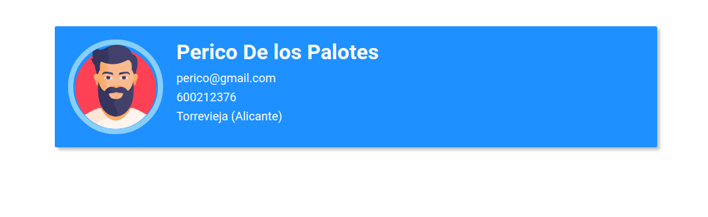

[<< Volver](https://github.com/kode-neko/super-gestor-empleados)

# 1. Mi Primer Componente

Vamos a comenzar con un pequeño ejercicio. Lo haremos de 2 formas, una con "vanila JavaScript" y otra con "React".  Primero crea una carpeta con estos ficheros y estructura:

- [style.css](../ejemplo/style.css)
- [man.png](../ejemplo/man.png)

```
📂 ejemplo
 ┣ 📜 react.html
 ┣ 📜 vanila-js.html
 ┣ 🎨 style.css
 ┣ 🖼️ man.png
```

En ambas formas obtendremos el siguiente componente.




## 1.1. Vanila JS

¿Qué significa **Vanila JavaScript**? Utilizar JS sin la ayuda de una librería o framework para manejar los elementos del DOM. Solo valernos de la API de su core sin utilizar los "Web Components" ¿Qué son? no nos compete ahora explicarlo. Al final de los apuntes profundizaremos en ello 😉

```html
<!DOCTYPE html>
<html lang="en">
  <head>
    <meta charset="UTF-8" />
    <meta http-equiv="X-UA-Compatible" content="IE=edge" />
    <meta name="viewport" content="width=device-width, initial-scale=1.0" />
    <script>
      window.addEventListener("load", () => {
        const user = {
          avatar: "man.png",
          name: "Perico",
          surname: "De los Palotes",
          mail: "perico@palotes.com",
          phone: 600212376,
          city: "Torrevieja",
          state: "Alicante",
        };

        const app = document.getElementById("app");
        app.innerHTML += `
          <div id="userList">
              <div class="idCard">
                  
                  <div class="info">
                      <h3 class="name">${user.name} ${user.surname}</h3>
                      <ul>
                          <li>${user.mail}</li>
                          <li>${user.phone}</li>
                          <li>${user.city} (${user.state})</li>
                      </ul>
                  </div>
              </div>
          </div>
      `;
      });
    </script>
    <link rel="stylesheet" href="style.css" />
    <title>Ejemplo Vanila JS</title>
  </head>
  <body>
    <div id="app" />
  </body>
</html>

```

Visto así parece sencillo. Pero imagínate que queremos hacer una web completa, por ejemplo un blog de noticias. Necesitamos un menú, encabezado, cuerpo, pié de página, los artículos, otras páginas... La cantidad de archivos aumentaría considerablemente 😵 Y no solo eso, queremos que los distintos contenidos vayan apareciendo y desapareciendo en la misma página. Es decir, que al dar a un enlace del menú no recargue una nueva página, usar peticiones asíncronas y manipular el DOM haciendo aparecer y desaparecer "cosas". Esto son lo que se llaman **webs dinámicas** o **single page application (SPP)**.

La web resultante sería tan compleja que aparecen los siguientes problemas:

* Desorganización de ficheros
* Dificultad en encontrar errores
* Dificultad en introducir nuevos cambios

Aunque seas disciplinado en el nombrado y organización de ficheros, carpetas y código, al final cuesta mucho mantenerlo 😩


## 1.2. React

Es una librería que nos ayuda a solventar los problemas comentados. Facilita la creación de código JavaScript o código frontal. existen otars tecnologías como Angular o Vue.js. 

```html
<!DOCTYPE html>
<html lang="en">
  <head>
    <meta charset="UTF-8" />
    <meta http-equiv="X-UA-Compatible" content="IE=edge" />
    <meta name="viewport" content="width=device-width, initial-scale=1.0" />
    
    <!-- Dependencias para pdoer usar React -->
    <script src="https://unpkg.com/react@17/umd/react.development.js" crossorigin ></script>
    <script src="https://unpkg.com/react-dom@17/umd/react-dom.development.js" crossorigin></script>
    <script src="https://unpkg.com/@babel/standalone/babel.min.js" crossorigin></script>
      
    <script type="text/babel">
      const CardId = (props) => {
        const {user} = props;
        return (
          <div id="userList">
            <div class="idCard">
              
              <div class="info">
                <h3 class="name">{user.name} {user.surname}</h3>
                <ul>
                  <li>{user.mail}</li>
                  <li>{user.phone}</li>
                  <li>
                    {user.city} ({user.state})
                  </li>
                </ul>
              </div>
            </div>
          </div>
        );
      };

      window.addEventListener("load", () => {
        const user = {
          avatar: "man.png",
          name: "Perico",
          surname: "De los Palotes",
          mail: "perico@gmail.com",
          phone: 600212376,
          city: "Torrevieja",
          state: "Alicante",
        };
        ReactDOM.render(<CardId user={user} />, document.getElementById("app"));
      });
    </script>
      
    <link rel="stylesheet" href="style.css" />
    <title>Document</title>
  </head>
  <body>
    <div id="app" />
  </body>
</html>
```


Hemos tenido que importar 3 dependencias

- **React**: Con React desarrollamos los componentes

- **ReactDOM**: Permite a estos componentes incluirse en el DOM

- **Babel**: Babel es un traspialdor, coge el código JS y lo reescribe. Su principal objetivo es hacerlo operativo entre distintas versiones de JS. Por ejemplo, quieres usar promesas pero el navegador es tan antiguo que no sabe lo que son. Babel reescribe las promesas para que las entienda. En este caso lo usa para traspilar JSX. Los creadores de React lo consideran como una extensión de JavaScript. Gracias a JSX hemos podido en la función CardId devolver codigo HTML sin incluirlo como una cadena de texto.

  

A lo largo del curso iras interiorizando todo esto mejor. Haremos un proyecto que consistira en una pequeña web para gestionar empelados 🖥️


## 1.3. Yarn

Para las prácticas en esta ocasión vamos a usar Yarn. Si conoces Npm te adelanto que es prácticamente lo mismo.

- Si has estado usando NPM para gestionar dependencias globales, no hay que descargarlas de nuevo. Yarn usa la misma organización de dependencias de NPM.
- No hay que tocar el package.json, también lo usa Yarn.
- Lo único que cambia es el package.lock. Yarn usa el suyo propio llamado yarn.lock. Ambos sirven para controlar el arbol de dependencias.
- Yarn es más rápido a la hroa de descargarse depenencias. Las decarga en paralelo.
- Los comandos son distintos.

Para instalarlo hacemos `npm install --global yarn` 

| NPM                                  | Yarn                        |
| ------------------------------------ | --------------------------- |
| `npm init`                           | `yarn init`                 |
| ``npm install [package]``            | `yarn add [package]`        |
| ``npm install --save-dev [package]`` | `yarn [package] --dev`      |
| `npm install --global [package]`     | `yarn global add [package]` |
| `npm update [package]`               | `yarn up [package]`         |
| `yarn unistall [package]`            | `yarn remove [package]`     |


## 1.4. create-react-app

Para facilitar la construcción de un proyecto con React tenemos la herramienta `create-react-app`.

```bash
yarn add global create-react-app
```

Vamos a comenzar con el proyecto "Super Gestor de Empleados"

```bash
yarn creact-app super-gestor-empleados
yarn start
```

Nos mostrará una página bonita con el logo de React dando vueltas.


⭐ **Webpack**

> Los proyectos de create-react-app usan por debajo Webpack. Ésta herramienta sirve para automatizar la construcción de proyectos javascript. Es una herramienta bastante compleja de utilizar. Podemos nosotros mismos con ella crear nuestra propia construcción con React. Pero sinceramente, hacen falta sudor y lagrimas. 


[<< Volver](https://github.com/kode-neko/super-gestor-empleados)