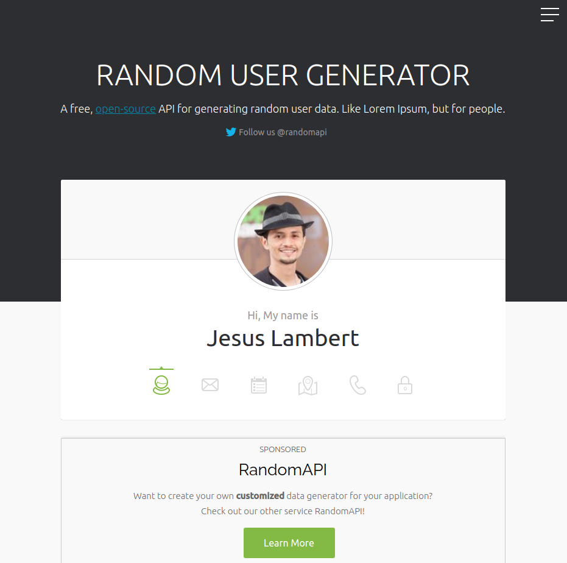
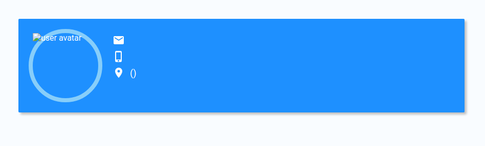
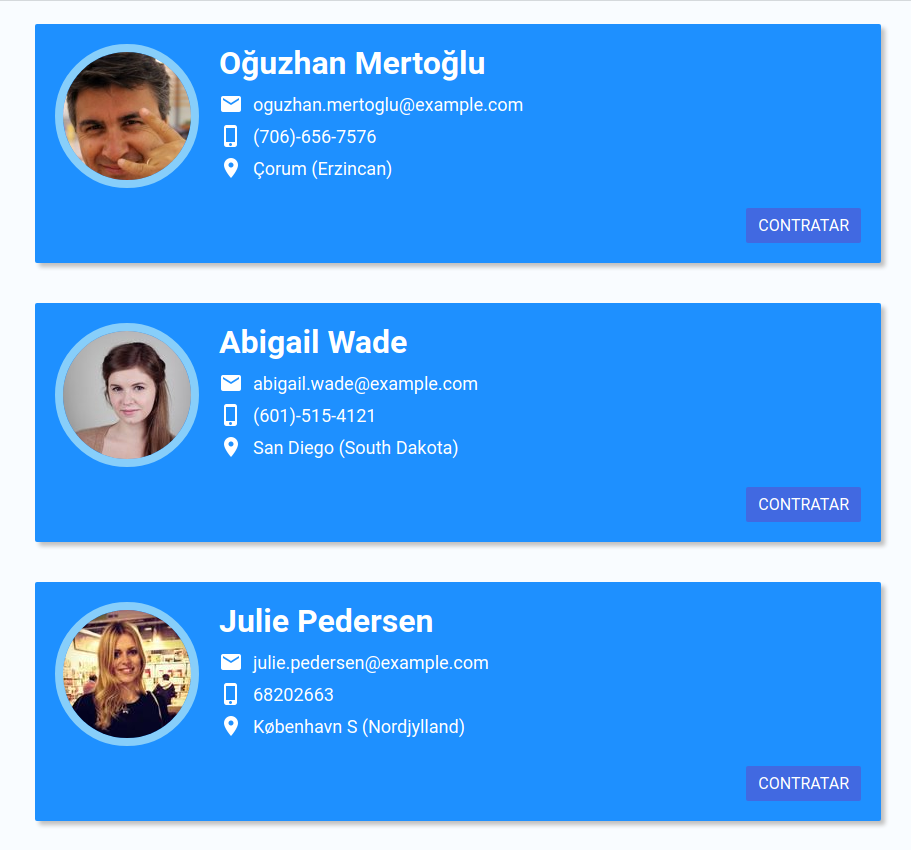

[<< Volver](https://github.com/kode-neko/super-gestor-empleados)

# 3. Propiedades y Estado

- [3.1. Propiedades](#21-creación)
- [3.2. Ciclo de Vida & Estado](#32-Ciclo-de-Vida-&-Estado)
- [3.3. Comunicación Padre e Hijo](#33-Comunicación-Padre-e-Hijo)
- [3.4. Condicionales en JSX](#34-Condicionales-en-JSX)
- [3.5. Listados de Componentes](#35-Listados-de-Componentes)

---

## 3.1. Propiedades

La idea es tener un listado de usuarios y mostrar un `IdCard` por cada uno 👤

El componente `IdCard` hay que prepararlo para que reciba cualquier información de un usuario. El componente padre que encierre `IdCard` es el encargado de pasar la información del usuario. Para ello creamos en `IdCard` la propiedad "user".

**IdCard.jsx**

```jsx
const IdCard = (props) => {
  const { user } = props;
  return (
    <div className={styles.idCard}>
      
      <div className={styles.info}>
        <h3 className={styles.name}>
          {user.name} {user.surname}
        </h3>
        <ul>
          <li className={styles.location}>
            {" "}
            {user.email}
          </li>
          <li className={styles.phone}>
            {" "}
            {user.phone}
          </li>
          <li className={styles.location}>
            {" "}
            {user.city} ({user.state})
          </li>
        </ul>
      </div>
    </div>
  );
};
```

**App.js**

```jsx
function App() {
  const user = {
    avatar: "man.png",
    name: "Perico",
    surname: "De los Palotes",
    email: "perico@gmail.com",
    phone: 600212376,
    city: "Torrevieja",
    state: "Alicante",
  };

  return (
    <div className="App">
      <IdCard user={user} />
    </div>
  );
}
```

📓 **Propiedades**

> Mecanismo para pasar información de un componente padre a uno hijo. Esta formado por un conjunto de atributos.

## 3.2. Ciclo de Vida & Estado

Usaremos la API rest pública [Random User Generator](https://randomuser.me/) 🖥️



Primero obtengamos un usuario y lo pasamos a la `IdCard`

**App.js**

```jsx
function App() {
  let userFetch = {};

  fetch("https://randomuser.me/api/")
    .then((data) => data.json())
    .then((json) => {
      const user = json.results[0];
      userFetch = {
        avatar: user.picture.large,
        name: user.name.first,
        surname: user.name.last,
        email: user.email,
        phone: user.phone,
        city: user.location.city,
        state: user.location.state,
      };
    });

  return (
    <div className="App">
      <IdCard user={userFetch} />
    </div>
  );
}
```



¿Qué ocurre? La tarjeta `IdCard` no muestra nada. Vamos a introducir el concepto de "ciclo de vida" de un componente 🌲

📓 **Ciclo de Vida**

> Las fases por las que pasa un componente desde su creación hasta su destrucción. En cada una se realizan unas operaciones.
>
> - **Mount**: Cuando se crea.
> - **Upload**: Las actualizaciones en el DOM. Se producen cuando cambia el estado del componente.
> - **UnMount**: Cuando se destruye. Ocurre cuando el componente padre deja de renderizarlo.

Cuando `fetch` hace una petición se resuelve tras montarse el componente. Cuando termina de montarse está incluido en el DOM y renderizado en la pantalla. Para que el componente vuelva a renderizarse hay que actualizar su estado.

📓 **Estado**

> Conjunto de variables/propiedades de un componente. Solo éste puede acceder a ellas. Al modificar alguna de ellas vuelve a renderizarse el componente.

Vamos a crear una propiedad en el estado llamada `user`. Cada vez que se cambie provocará que el componente se renderice de nuevo. Cuando `fetch` obtenga la respuesta es cuando cambiamos el estado. Para ello nos ayudaremos de un "hook" llamado `useState`. De momento quédate que los hooks son funciones que nos hace la vida más bonita con React 🌈

**App.js**

```jsx
import "./App.css";
import React, { useState } from "react";
import IdCard from "./idcard";

function App() {
  const [user, setUser] = useState({});

  fetch("https://randomuser.me/api/")
    .then((data) => data.json())
    .then((json) => {
      const user = json.results[0];
      setUser({
        avatar: user.picture.large,
        name: user.name.first,
        surname: user.name.last,
        email: user.email,
        phone: user.phone,
        city: user.location.city,
        state: user.location.state,
      });
    });

  return (
    <div className="App">
      <IdCard user={user} />
    </div>
  );
}

export default App;
```

¡Oh Dios mio que está pasando! 😱 Si nos vamos a la consola de navegación, vemos que en el panel de network hay llamadas infinitas a la API. Cuando actualiza el estado ejecuta todo el código del componente de nuevo. Por tanto volverá a ejecutarse `fetch` y se repite el bucle. Para evitarlo usaremos otro hook llamado `useEffect`. Nos permite indicar que acciones ejecutar cuando se monta o actualiza el componente. En este caso indicaremos que se ejecuta una acción solo cuando se monta. Así nos garantizamos de que lo hace una sola vez 😉

**App.js**

```jsx
import "./App.css";
import React, { useState, useEffect } from "react";
import IdCard from "./idcard";

function App() {
  const [user, setUser] = useState(undefined);

  useEffect(() => {
    fetch("https://randomuser.me/api/")
      .then((data) => data.json())
      .then((json) => {
        const user = json.results[0];
        setUser({
          avatar: user.picture.large,
          name: user.name.first,
          surname: user.name.last,
          email: user.email,
          phone: user.phone,
          city: user.location.city,
          state: user.location.state,
        });
      });
  }, []);

  return (
    <div className="App">
      <IdCard user={user} />
    </div>
  );
}

export default App;
```

¡Solucionado! 🎉

## 3.3. Condicionales en JSX

Como somos tan profesionales nos hemos dado cuenta de otro problema. Durante un segundo vemos la `IdCard` sin información. Vamos a poner un condicional en el `return`. Si la información del usuario está vacía que muestre un spinner ♻️ sino la `IdCard` 👤

**App.js**

```jsx
function App() {
  const [user, setUser] = useState(undefined);

  ...

  return user ? (
    <div className="App">
      <IdCard user={user} />
    </div>
  ) : (
    
  );
}
```

Podemos hacer un condicional incluso en el valor de los atributos o textos de una etiqueta.

```jsx
const ToggleBtn = () => {
  const [switch, setSwitch] = useState(false);
  return (
    <button className={switch ? styles.on : styles.off}>
      {switch ? 'ON' : 'OFF'}
    </button>
  );
}
```

## 3.4. Listados de Componentes

Solo mostramos un empleado. Pero lo interesante es mostrar varios en un listado.

**App.js**

```jsx
function App() {
  const [userList, setUserList] = useState([]);

  useEffect(() => {
    fetch("https://randomuser.me/api/?results=10")
      .then((data) => data.json())
      .then((json) => {
        const userListAux = json.results.map((user) => ({
          avatar: user.picture.large,
          name: user.name.first,
          surname: user.name.last,
          email: user.email,
          phone: user.phone,
          city: user.location.city,
          state: user.location.state,
        }));
        setUserList(userListAux);
      });
  }, []);

  return userList.length !== 0 ? (
    <div className="userList">
      {userList.map((user) => (
        <IdCard user={user} />
      ))}
    </div>
  ) : (
    
  );
}
```

Modificaciones:

- El `useState` almacena una lista.
- En el `fetch` colocamos en la url el parametro `result=10`
- El resultado del `fetch` se parsea. Cogemos de cada usuario la información que queremos.
- Cuando devolvemos el template vemos que hay una iteración. Creamos un nuevo `IdCard` por usuario.
- Ahora el spinner aparece cuando la lista sea vacía.

JSX permite trabajar con código html como si estuvieramos programando. A diferencia de otras librería o frameworks, no tenemos que aprender apenas una sintaxis extra.

## 3.5. Comunicación Padre e Hijo

No, este apartado no trata de resolución de conflictos familiares 😂 Hemos visto como `App` envía información a `IdCard` a través de la propiedad user. En React los componentes se comuncian en una única dirección. Sin embargo usando un pequeño hack podemos hacer que el hijo envíe información al padre 👨‍👦

Queremos que nuestra increible aplicación pueda contratar o despedir empleados. Para ello incluiremos un nuevo botón en `IdCard`. También modificamos el `App` para que los usuarios tengan un atributo llamado "contratado".

**IdCard.jsx**

```jsx
import styles from "./idcard.module.css";

const IdCard = (props) => {
  const { user } = props;
  return (
    <div className={styles.idCard}>
      
      <div className={styles.info}>
        <h3 className={styles.name}>
          {user.name} {user.surname}
        </h3>
        <ul>
          <li className={styles.location}>
            {" "}
            {user.email}
          </li>
          <li className={styles.phone}>
            {" "}
            {user.phone}
          </li>
          <li className={styles.location}>
            {" "}
            {user.city} ({user.state})
          </li>
        </ul>
        <div className={styles.actions}>
          <button className={styles.btn}>
            {user.contratado ? "Despedir" : "Contratar"}
          </button>
        </div>
      </div>
    </div>
  );
};

export default IdCard;
```

**App.js**

```jsx
function App() {
  ...

  useEffect(() => {
    fetch("https://randomuser.me/api/")
    .then((data) => data.json())
    .then((json) => {
      const user = json.results[0];
      setUser({
        avatar: user.picture.large,
        name: user.name.first,
        surname: user.name.last,
        email: user.email,
        phone: user.phone,
        city: user.location.city,
        state: user.location.state,
        contratado: false
      });
    });
  }, []);

  ...
}
```



La idea es que al apretar el botón indiquemos a `App` que el empleado ha sido contratado o no. De esta forma puede actualizar al usuario del listado. Para ello creamos una propiedad llamada "onClickContratado" al que pasamos un callBack o función.

**IdCard.jsx**

```jsx
const IdCard = (props) => {
  const { user, onClickContratado } = props;
  return (
    <div className={styles.idCard}>
      ...
      <button
        className={styles.btn}
        onClick={() => onClickContratado(user.email)}
      >
        {user.contratado ? "Despedir" : "Contratar"}
      </button>
      ...
    </div>
  );
};
```

**App.js**

```jsx
function App() {
  ...

  return (
    <div className="App">
       <IdCard
          user={user}
          onClickContratado={(email) => {
            const newList = userList.map((user) =>
              user.email === email
                ? { ...user, contratado: !user.contratado }
                : user
            );
            setUserList(newList);
          }}
       />
    </div>
  )
}
```

Hacemos click en botón. En ese momento ejecuta la funcion onClickContratado(). Pero resulta que se ejecuta en el componente padre. Para saber que usuario modificar pasamos el email, que funcionaria como identificador único.

<video width="320" height="240" controls autoplay>
    <source src="src/btn-contratar.mp4" type="video/mp4" />
    Your browser does not support the video tag.
</video>

🎲 **Ejercicio**

> Vamos a incluir la barra superior de la web. Será un componente y se llamará `MainBar`.
>
> [img]
>
> Para ello se proporciona el CSS y la plantilla HTML. A partir de esto hay que crear el componente y hacer que aparezca en la web. Tienes que ingeniartelas para que se actualice el indicador de empleados contratados.
>
> **html**
>
> ```html
> <div class="mainBar">
>   <h1 class="title">Super Gestor Empleados</h1>
>   <div class="right">
>     <div class="counter">contratados 0/10</div>
>     <div class="{styles.add}">Añadir Empleado</div>
>   </div>
> </div>
> ```
>
> **css**
>
> ```css
> .mainBar {
>   background-color: rgb(0, 16, 34);
>   color: white;
>   display: flex;
>   justify-content: space-between;
>   width: 100%;
>   padding: 20px;
>   position: fixed;
>   top: 0;
>   left: 0;
>   z-index: 10;
>   box-sizing: border-box;
>   box-shadow: 0px 4px 4px black;
> }
>
> .title {
>   margin: 0;
>   padding: 0;
> }
>
> .right {
>   display: flex;
>   align-items: center;
> }
>
> .right .add {
>   display: inline-block;
>   text-decoration: none;
>   background-color: tomato;
>   color: white;
>   border: none;
>   font-size: 18px;
>   padding: 8px 16px;
>   border-radius: 2px;
>   cursor: pointer;
>
>   transition: background-color 0.3s;
> }
>
> .right .add:hover {
>   background-color: orangered;
> }
>
> .right .counter {
>   display: flex;
>   align-items: center;
>   font-size: 18px;
>   margin-right: 20px;
> }
> ```

[<< Volver](https://github.com/kode-neko/super-gestor-empleados)
